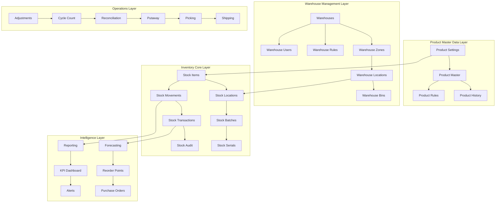

# 🏗️ Advanced Stock Management System Architecture
## نظام إدارة المخازن المتقدم - التصميم المعماري الشامل

> **Vision**: Build a world-class warehouse management system that rivals SAP, Oracle WMS, and Microsoft Dynamics, specifically designed for pharmaceutical distribution with Arabic/RTL support.

## 🎯 Core Architecture Principles

### 1. **Product Settings as Single Source of Truth**
- All product master data (name, price, specifications) stored in Settings
- Stock system references products by ID only
- Automatic synchronization and data consistency
- Version control for product changes

### 2. **Multi-Warehouse, Multi-Location Architecture**
- Hierarchical warehouse structure (Company → Warehouse → Zone → Location → Bin)
- Unlimited warehouse locations
- Inter-warehouse transfers and allocations
- Location-based stock tracking

### 3. **Real-Time Stock Tracking**
- Every stock movement tracked with full audit trail
- Real-time inventory updates
- Concurrent transaction handling
- ACID compliance for all stock operations

### 4. **Advanced Analytics & Intelligence**
- AI-powered demand forecasting
- Automatic reorder point calculations
- Dead stock identification
- Velocity analysis (Fast/Medium/Slow moving)

## 🏛️ System Architecture



## 📊 Database Schema Design

### Core Tables Structure

#### 1. **Product Integration Tables**
```sql
-- Link to product settings (read-only reference)
CREATE TABLE product_stock_config (
    id UUID PRIMARY KEY DEFAULT gen_random_uuid(),
    product_id UUID NOT NULL REFERENCES products(id),
    
    -- Stock control settings
    is_stock_tracked BOOLEAN DEFAULT true,
    use_batches BOOLEAN DEFAULT false,
    use_serials BOOLEAN DEFAULT false,
    use_expiry_dates BOOLEAN DEFAULT true,
    
    -- Reorder settings
    reorder_level INTEGER DEFAULT 0,
    reorder_quantity INTEGER DEFAULT 0,
    max_stock_level INTEGER DEFAULT 999999,
    
    -- Costing method
    costing_method VARCHAR(20) DEFAULT 'FIFO', -- FIFO, LIFO, Average
    
    created_at TIMESTAMP DEFAULT NOW(),
    updated_at TIMESTAMP DEFAULT NOW()
);
```

#### 2. **Warehouse Structure**
```sql
-- Multi-level warehouse hierarchy
CREATE TABLE warehouses (
    id UUID PRIMARY KEY DEFAULT gen_random_uuid(),
    code VARCHAR(20) UNIQUE NOT NULL,
    name VARCHAR(255) NOT NULL,
    type VARCHAR(50) NOT NULL, -- Main, Branch, Virtual, Transit
    
    -- Location details
    address TEXT,
    city VARCHAR(100),
    country VARCHAR(100) DEFAULT 'Egypt',
    latitude DECIMAL(10, 8),
    longitude DECIMAL(11, 8),
    
    -- Operational settings
    is_active BOOLEAN DEFAULT true,
    allow_negative_stock BOOLEAN DEFAULT false,
    auto_allocate BOOLEAN DEFAULT true,
    
    -- Hierarchy
    parent_warehouse_id UUID REFERENCES warehouses(id),
    
    created_at TIMESTAMP DEFAULT NOW(),
    updated_at TIMESTAMP DEFAULT NOW()
);

CREATE TABLE warehouse_zones (
    id UUID PRIMARY KEY DEFAULT gen_random_uuid(),
    warehouse_id UUID NOT NULL REFERENCES warehouses(id) ON DELETE CASCADE,
    code VARCHAR(20) NOT NULL,
    name VARCHAR(255) NOT NULL,
    zone_type VARCHAR(50), -- Receiving, Storage, Picking, Shipping, Quarantine
    
    is_active BOOLEAN DEFAULT true,
    sort_order INTEGER DEFAULT 0,
    
    UNIQUE(warehouse_id, code)
);

CREATE TABLE warehouse_locations (
    id UUID PRIMARY KEY DEFAULT gen_random_uuid(),
    warehouse_id UUID NOT NULL REFERENCES warehouses(id) ON DELETE CASCADE,
    zone_id UUID REFERENCES warehouse_zones(id) ON DELETE SET NULL,
    
    code VARCHAR(50) NOT NULL, -- A-01-001-A (Aisle-Bay-Level-Position)
    name VARCHAR(255),
    barcode VARCHAR(100),
    
    -- Physical properties
    location_type VARCHAR(50) DEFAULT 'Storage', -- Receiving, Storage, Picking, QC, etc.
    capacity_weight DECIMAL(12,3),
    capacity_volume DECIMAL(12,3),
    
    -- Status
    is_active BOOLEAN DEFAULT true,
    is_blocked BOOLEAN DEFAULT false,
    block_reason TEXT,
    
    UNIQUE(warehouse_id, code)
);
```

#### 3. **Advanced Stock Tracking**
```sql
-- Main stock table with real-time balances
CREATE TABLE stock_balances (
    id UUID PRIMARY KEY DEFAULT gen_random_uuid(),
    
    -- Product reference (from settings)
    product_id UUID NOT NULL REFERENCES products(id),
    
    -- Location hierarchy
    warehouse_id UUID NOT NULL REFERENCES warehouses(id),
    location_id UUID REFERENCES warehouse_locations(id),
    
    -- Batch/Lot tracking
    batch_number VARCHAR(100),
    expiry_date DATE,
    manufacturing_date DATE,
    
    -- Serial tracking
    serial_number VARCHAR(100),
    
    -- Quantities (multi-unit support)
    quantity_on_hand DECIMAL(15,3) NOT NULL DEFAULT 0,
    quantity_allocated DECIMAL(15,3) NOT NULL DEFAULT 0,
    quantity_available DECIMAL(15,3) GENERATED ALWAYS AS (quantity_on_hand - quantity_allocated) STORED,
    
    -- Cost tracking
    unit_cost DECIMAL(15,4) DEFAULT 0,
    total_cost DECIMAL(15,2) GENERATED ALWAYS AS (quantity_on_hand * unit_cost) STORED,
    
    -- Status
    status VARCHAR(50) DEFAULT 'Available', -- Available, Hold, Damaged, Expired, Quarantine
    
    -- Audit fields
    created_at TIMESTAMP DEFAULT NOW(),
    updated_at TIMESTAMP DEFAULT NOW(),
    created_by UUID REFERENCES users(id),
    
    UNIQUE(product_id, warehouse_id, location_id, batch_number, serial_number)
);

-- Complete audit trail of all stock movements
CREATE TABLE stock_movements (
    id UUID PRIMARY KEY DEFAULT gen_random_uuid(),
    
    -- Transaction reference
    transaction_type VARCHAR(50) NOT NULL, -- IN, OUT, TRANSFER, ADJUSTMENT
    transaction_id UUID, -- Reference to source transaction
    document_number VARCHAR(100),
    
    -- Product and location
    product_id UUID NOT NULL REFERENCES products(id),
    warehouse_id UUID NOT NULL REFERENCES warehouses(id),
    location_id UUID REFERENCES warehouse_locations(id),
    
    -- Batch/Serial info
    batch_number VARCHAR(100),
    serial_number VARCHAR(100),
    expiry_date DATE,
    
    -- Movement quantities
    quantity_before DECIMAL(15,3) NOT NULL,
    quantity_moved DECIMAL(15,3) NOT NULL, -- +ve for IN, -ve for OUT
    quantity_after DECIMAL(15,3) NOT NULL,
    
    -- Cost information
    unit_cost DECIMAL(15,4),
    total_cost DECIMAL(15,2),
    
    -- Transfer details (if applicable)
    from_warehouse_id UUID REFERENCES warehouses(id),
    from_location_id UUID REFERENCES warehouse_locations(id),
    to_warehouse_id UUID REFERENCES warehouses(id),
    to_location_id UUID REFERENCES warehouse_locations(id),
    
    -- Reason and notes
    reason_code VARCHAR(50), -- SALE, PURCHASE, TRANSFER, ADJUSTMENT, DAMAGE, EXPIRED
    notes TEXT,
    
    -- Audit trail
    movement_date TIMESTAMP NOT NULL DEFAULT NOW(),
    created_by UUID NOT NULL REFERENCES users(id),
    
    -- Approval workflow
    requires_approval BOOLEAN DEFAULT false,
    approved_by UUID REFERENCES users(id),
    approved_at TIMESTAMP,
    
    created_at TIMESTAMP DEFAULT NOW()
);

-- Stock transactions for complex operations
CREATE TABLE stock_transactions (
    id UUID PRIMARY KEY DEFAULT gen_random_uuid(),
    
    transaction_number VARCHAR(100) UNIQUE NOT NULL,
    transaction_type VARCHAR(50) NOT NULL,
    
    -- Status workflow
    status VARCHAR(50) DEFAULT 'Draft', -- Draft, Submitted, Approved, Executed, Cancelled
    
    -- References
    warehouse_id UUID NOT NULL REFERENCES warehouses(id),
    reference_type VARCHAR(50), -- ORDER, PURCHASE, ADJUSTMENT, TRANSFER
    reference_id UUID,
    
    -- Totals
    total_items INTEGER DEFAULT 0,
    total_quantity DECIMAL(15,3) DEFAULT 0,
    total_cost DECIMAL(15,2) DEFAULT 0,
    
    -- Dates
    transaction_date DATE NOT NULL DEFAULT CURRENT_DATE,
    expected_date DATE,
    completed_at TIMESTAMP,
    
    -- Notes and attachments
    notes TEXT,
    attachments JSONB DEFAULT '[]',
    
    -- Workflow
    created_by UUID NOT NULL REFERENCES users(id),
    approved_by UUID REFERENCES users(id),
    executed_by UUID REFERENCES users(id),
    
    created_at TIMESTAMP DEFAULT NOW(),
    updated_at TIMESTAMP DEFAULT NOW()
);
```

#### 4. **Advanced Analytics Tables**
```sql
-- Demand forecasting and analytics
CREATE TABLE stock_analytics (
    id UUID PRIMARY KEY DEFAULT gen_random_uuid(),
    product_id UUID NOT NULL REFERENCES products(id),
    warehouse_id UUID NOT NULL REFERENCES warehouses(id),
    
    -- Time period
    analysis_date DATE NOT NULL,
    period_type VARCHAR(20) NOT NULL, -- DAILY, WEEKLY, MONTHLY
    
    -- Quantities
    opening_stock DECIMAL(15,3),
    closing_stock DECIMAL(15,3),
    receipts DECIMAL(15,3) DEFAULT 0,
    issues DECIMAL(15,3) DEFAULT 0,
    adjustments DECIMAL(15,3) DEFAULT 0,
    
    -- Velocity metrics
    velocity_class VARCHAR(10), -- A, B, C (Fast, Medium, Slow)
    turnover_ratio DECIMAL(10,2),
    days_of_stock INTEGER,
    
    -- AI predictions
    forecasted_demand DECIMAL(15,3),
    recommended_reorder_level INTEGER,
    stockout_risk_score DECIMAL(3,2), -- 0.00 to 1.00
    
    created_at TIMESTAMP DEFAULT NOW(),
    
    UNIQUE(product_id, warehouse_id, analysis_date, period_type)
);

-- Reorder management
CREATE TABLE reorder_recommendations (
    id UUID PRIMARY KEY DEFAULT gen_random_uuid(),
    product_id UUID NOT NULL REFERENCES products(id),
    warehouse_id UUID NOT NULL REFERENCES warehouses(id),
    
    current_stock DECIMAL(15,3) NOT NULL,
    reorder_level DECIMAL(15,3) NOT NULL,
    recommended_quantity DECIMAL(15,3) NOT NULL,
    
    -- AI calculations
    lead_time_days INTEGER,
    safety_stock DECIMAL(15,3),
    economic_order_qty DECIMAL(15,3),
    
    priority_score DECIMAL(3,2), -- Higher = more urgent
    risk_level VARCHAR(20), -- LOW, MEDIUM, HIGH, CRITICAL
    
    -- Status
    status VARCHAR(50) DEFAULT 'PENDING', -- PENDING, APPROVED, ORDERED, RECEIVED, CANCELLED
    
    created_at TIMESTAMP DEFAULT NOW(),
    processed_at TIMESTAMP,
    processed_by UUID REFERENCES users(id)
);
```

## 🔧 Advanced Features

### 1. **Real-Time Stock Synchronization**
- WebSocket connections for live updates
- Optimistic locking for concurrent operations
- Automatic conflict resolution
- Mobile app synchronization

### 2. **AI-Powered Intelligence**
- Machine learning demand forecasting
- Automatic ABC classification
- Seasonal trend analysis
- Anomaly detection

### 3. **Advanced Barcode/QR Integration**
- Product barcodes
- Location barcodes
- Batch/lot tracking
- Serial number tracking
- Mobile scanning apps

### 4. **Multi-Language & RTL Support**
- Arabic/English dual interface
- RTL layout optimization
- Arabic number formatting
- Cultural date/time formatting

## 📱 User Interface Components

### 1. **Executive Dashboard**
- Real-time KPI widgets
- Stock value trending
- Stockout alerts
- Velocity analysis charts

### 2. **Warehouse Operations**
- Mobile-first receiving interface
- Putaway optimization
- Pick path optimization
- Cycle count management

### 3. **Advanced Reporting**
- Inventory aging analysis
- Movement history reports
- Variance analysis
- Cost analysis reports

## 🔒 Security & Compliance

### 1. **Role-Based Access Control**
- Warehouse-level permissions
- Operation-specific roles
- Approval workflows
- Audit trail protection

### 2. **Regulatory Compliance**
- Pharmaceutical traceability
- Expiry date management
- Batch recall capabilities
- FDA/GMP compliance tracking

## 🚀 Performance Optimizations

### 1. **Database Optimizations**
- Partitioned tables by date/warehouse
- Materialized views for reports
- Intelligent indexing strategy
- Query optimization

### 2. **Caching Strategy**
- Redis for real-time balances
- Edge caching for product data
- Session-based user caching
- API response caching

## 📊 Integration Points

### 1. **ERP Integration**
- SAP connector
- Oracle WMS integration
- QuickBooks sync
- Custom API endpoints

### 2. **External Systems**
- Supplier portals
- Customer portals
- Shipping carriers
- Payment gateways

---

This architecture provides the foundation for a world-class warehouse management system that will revolutionize inventory control and provide unprecedented visibility into stock operations.