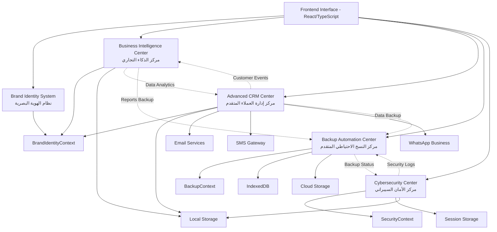
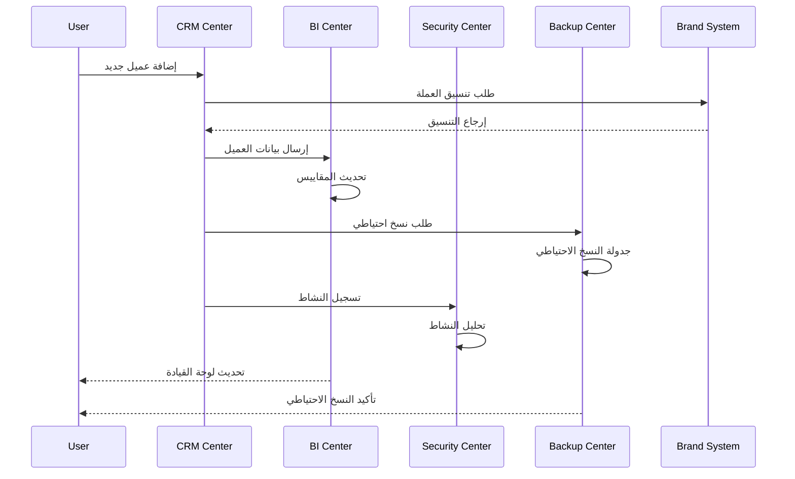

# المخطط التقني للمعمارية والتكامل بين المراكز

## 🏗️ الهيكل التقني الشامل



## 🔧 طبقات النظام التقنية

### 1. **طبقة العرض (Presentation Layer)**
```typescript
// المكونات الرئيسية
const systemComponents = {
  // مراكز رئيسية
  centers: [
    'AdvancedCRMCenter.tsx', 
    'BrandIdentityCenter.tsx',
    'BackupAutomationCenter.tsx',
    'CybersecurityCenter.tsx'
  ],
  
  // مكونات مشتركة
  shared: [
    'UnifiedBrandSystem.tsx',
    'ConfigPanel.tsx',
    'MetricCard.tsx',
    'DataTable.tsx'
  ]
};
```

### 2. **طبقة المنطق التجاري (Business Logic Layer)**
```typescript
// خدمات المنطق التجاري
const businessServices = {
  // خدمات الذكاء التجاري
  analytics: {
    calculateMetrics: '(data) => ProcessedMetrics',
    generateInsights: '(metrics) => Insights[]',
    predictTrends: '(historicalData) => Predictions'
  },
  
  // خدمات CRM
  crm: {
    manageCustomers: '(customers) => CustomerData[]',
    automateWorkflows: '(rules) => WorkflowExecution',
    trackInteractions: '(interactions) => InteractionLog'
  },
  
  // خدمات الأمان
  security: {
    detectThreats: '(logs) => ThreatAnalysis',
    generateReports: '() => SecurityReport',
    monitorCompliance: '() => ComplianceStatus'
  }
};
```

### 3. **طبقة إدارة الحالة (State Management Layer)**
```typescript
// مقدمو السياق (Context Providers)
const contextArchitecture = {
  // السياق الأساسي للهوية البصرية
  brandIdentity: {
    provider: 'BrandIdentityProvider',
    state: ['colors', 'fonts', 'logos', 'templates'],
    methods: ['updateConfig', 'generateCSS', 'formatCurrency']
  },
  
  // سياق النسخ الاحتياطي
  backup: {
    provider: 'BackupProvider', 
    state: ['schedules', 'backups', 'storageLocations'],
    methods: ['createBackup', 'restoreBackup', 'manageSchedules']
  },
  
  // سياق الأمان
  security: {
    provider: 'SecurityProvider',
    state: ['threats', 'incidents', 'compliance'],
    methods: ['logIncident', 'analyzeThreats', 'generateReport']
  }
};
```

### 4. **طبقة البيانات (Data Access Layer)**
```typescript
// استراتيجيات التخزين
const storageStrategy = {
  // التخزين المحلي للإعدادات
  localStorage: {
    keys: [
      'brandIdentity_config',
      'crm_customers', 
      'security_settings',
      'bi_dashboards'
    ]
  },
  
  // التخزين المؤقت للجلسة
  sessionStorage: {
    keys: [
      'current_session',
      'temp_calculations',
      'active_filters'
    ]
  },
  
  // قاعدة البيانات المحلية للبيانات المعقدة
  indexedDB: {
    stores: [
      'backups_metadata',
      'large_datasets',
      'historical_data'
    ]
  }
};
```

## 🔗 أنماط التكامل بين المراكز

### 1. **Event-Driven Integration**
```typescript
// نظام الأحداث المركزي
class EventBus {
  private listeners = new Map<string, Function[]>();
  
  // عند إضافة عميل جديد في CRM
  emit('customer:created', {
    customerId: 'CUST_001',
    data: customerData,
    timestamp: new Date()
  });
  
  // مركز الذكاء التجاري يستمع للحدث
  on('customer:created', (event) => {
    this.updateCustomerMetrics(event.data);
    this.refreshDashboard();
  });
  
  // نظام النسخ الاحتياطي يستمع للحدث  
  on('customer:created', (event) => {
    this.scheduleDataBackup('crm_data');
    this.updateBackupMetrics();
  });
}
```

### 2. **Shared State Management**
```typescript
// الحالة المشتركة بين المراكز
const sharedState = {
  // إعدادات الهوية البصرية متاحة لجميع المراكز
  brandConfig: useBrandIdentity(),
  
  // بيانات العملاء مشتركة بين CRM والذكاء التجاري
  customerData: useSharedData('customers'),
  
  // معلومات الأمان متاحة لجميع المراكز
  securityContext: useSecurityContext(),
  
  // حالة النظام العامة
  systemHealth: useSystemHealth()
};
```

### 3. **Cross-Module Communication**
```typescript
// التواصل بين المراكز
interface ModuleCommunication {
  // CRM يرسل بيانات للذكاء التجاري
  crmToBi: {
    method: 'sendCustomerMetrics',
    data: CustomerMetrics,
    callback: (response: AnalyticsResult) => void
  };
  
  // الأمان يرسل تنبيهات للنسخ الاحتياطي
  securityToBackup: {
    method: 'triggerEmergencyBackup',
    data: SecurityIncident,
    priority: 'high' | 'critical'
  };
  
  // الذكاء التجاري يطلب نسخ احتياطي للتقارير
  biToBackup: {
    method: 'scheduleReportBackup', 
    data: ReportMetadata,
    schedule: CronExpression
  };
}
```

## 🎨 نظام الهوية البصرية الموحد

### التكامل مع جميع المراكز
```typescript
// نظام الأنماط الموحد
const unifiedStyling = {
  // ألوان موحدة عبر جميع المراكز
  colors: {
    primary: brandConfig.primaryColor,
    secondary: brandConfig.secondaryColor,
    success: brandConfig.successColor,
    warning: brandConfig.warningColor,
    danger: brandConfig.dangerColor
  },
  
  // خطوط موحدة
  fonts: {
    heading: brandConfig.headingFont,
    body: brandConfig.bodyFont,
    code: brandConfig.codeFont
  },
  
  // مكونات UI موحدة
  components: {
    card: generateCardStyle(brandConfig),
    button: generateButtonStyle(brandConfig), 
    table: generateTableStyle(brandConfig),
    chart: generateChartStyle(brandConfig)
  }
};
```

## 📊 تدفق البيانات والمعلومات



## 🔒 أمان التكامل والتواصل

### 1. **Token-Based Authentication**
```typescript
// نظام المصادقة الموحد
const authSystem = {
  generateToken: (moduleId: string, permissions: string[]) => {
    return jwt.sign({ moduleId, permissions }, SECRET_KEY);
  },
  
  validateToken: (token: string, requiredPermission: string) => {
    const decoded = jwt.verify(token, SECRET_KEY);
    return decoded.permissions.includes(requiredPermission);
  }
};
```

### 2. **Encrypted Data Exchange**
```typescript
// تشفير البيانات المنقولة بين المراكز
const secureDataExchange = {
  encrypt: (data: any, recipientModule: string) => {
    const key = getModuleKey(recipientModule);
    return AES.encrypt(JSON.stringify(data), key).toString();
  },
  
  decrypt: (encryptedData: string, senderModule: string) => {
    const key = getModuleKey(senderModule);
    const decrypted = AES.decrypt(encryptedData, key);
    return JSON.parse(decrypted.toString(enc.Utf8));
  }
};
```

## 🚀 معايير الأداء والتحسين

### 1. **Lazy Loading Strategy**
```typescript
// تحميل المراكز حسب الحاجة
const lazyModules = {
  BusinessIntelligence: lazy(() => 
  ),
  AdvancedCRM: lazy(() => 
    import('./advanced-crm-center') 
  ),
  BackupAutomation: lazy(() =>
    import('./backup-automation-center')
  ),
  Cybersecurity: lazy(() =>
    import('./cybersecurity-center')
  )
};
```

### 2. **Caching and Memoization**
```typescript
// تحسين الأداء عبر التخزين المؤقت
const performanceOptimization = {
  // تخزين مؤقت للحسابات المعقدة
  memoizedCalculations: new Map(),
  
  // تخزين مؤقت لاستعلامات البيانات
  dataCache: new Map(),
  
  // تحميل تدريجي للبيانات الكبيرة
  virtualizedLists: true,
  
  // تحسين عرض الجداول الكبيرة
  paginationStrategy: 'infinite-scroll'
};
```

## 📈 مراقبة الأداء والصحة

### System Health Monitoring
```typescript
// مراقبة صحة النظام في الوقت الفعلي
const systemMonitoring = {
  // مراقبة استخدام الذاكرة
  memoryUsage: () => performance.memory,
  
  // مراقبة زمن الاستجابة
  responseTime: new Map<string, number>(),
  
  // مراقبة الأخطاء
  errorTracking: {
    count: 0,
    lastError: null,
    errorsByModule: new Map()
  },
  
  // مراقبة اتصال المراكز
  moduleConnectivity: {
    crm: 'connected',
    bi: 'connected', 
    security: 'connected',
    backup: 'connected'
  }
};
```

## 🏆 النتيجة النهائية

### ✅ التكامل المحقق:

1. **🔗 ترابط منطقي**: كل مركز مترابط بذكاء مع الآخرين
2. **🎨 هوية موحدة**: نظام هوية بصرية شامل ومطبق عالمياً
3. **🔒 أمان متدرج**: حماية على جميع مستويات التكامل
4. **📊 تدفق بيانات ذكي**: تبادل معلومات فعال وآمن
5. **🚀 أداء محسّن**: استراتيجيات تحسين متقدمة
6. **📈 مراقبة شاملة**: رصد مستمر لصحة النظام

---

**"التكامل الحقيقي ليس مجرد ربط أنظمة، بل خلق نظام بيئي ذكي يعمل كوحدة واحدة متماسكة"** 🌟